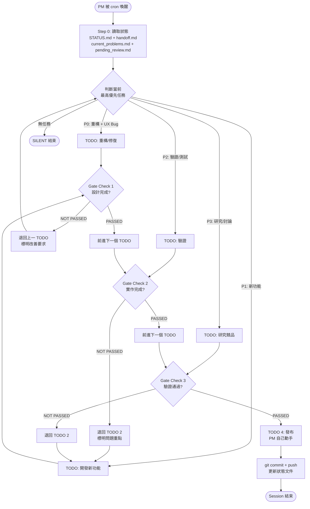
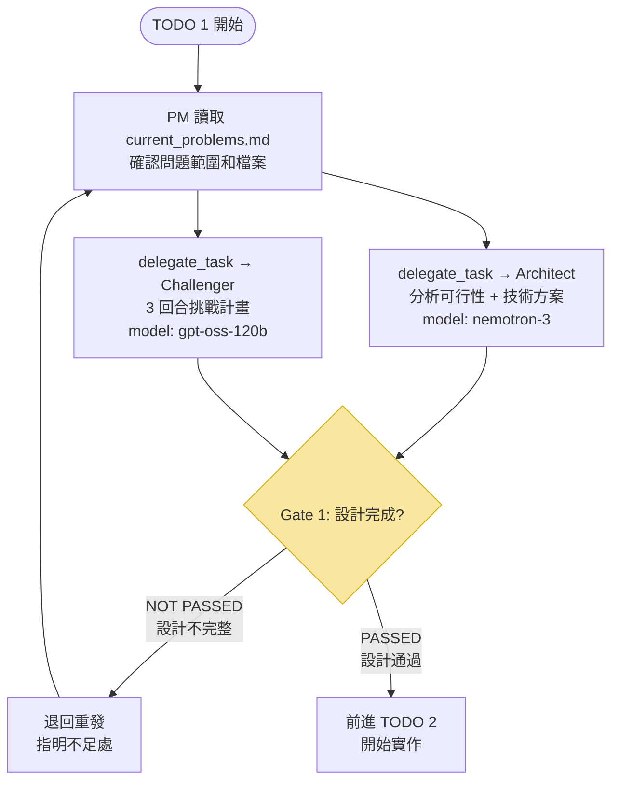
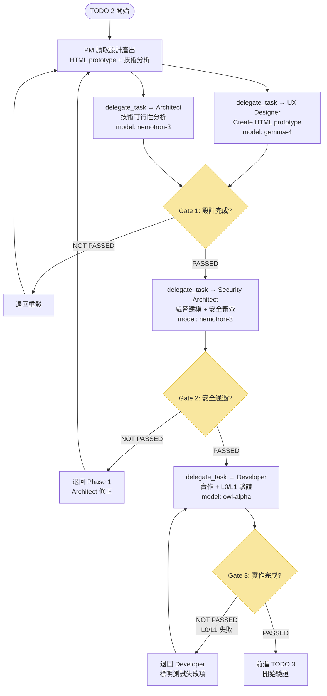
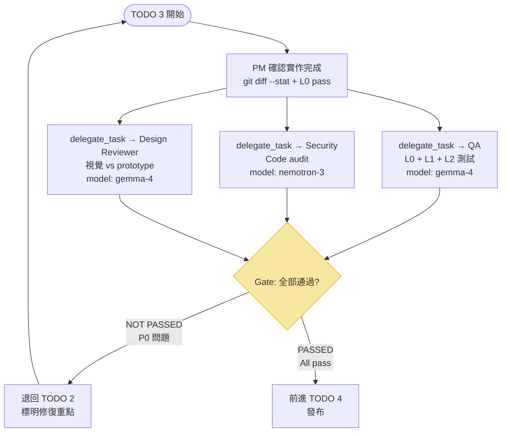
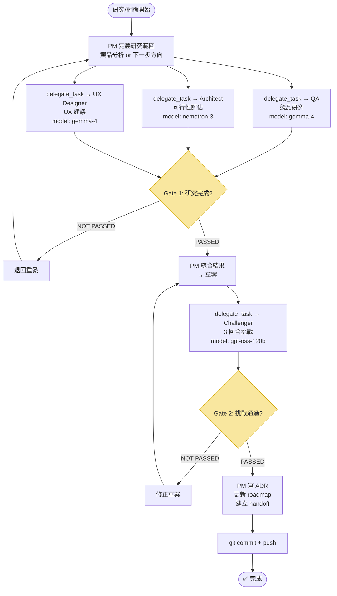
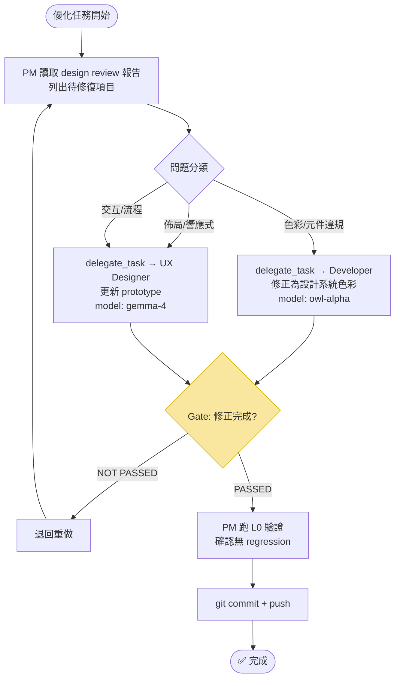

# Stock Explorer — PM 流程圖

> 本文件包含所有 PM 工作流的 Mermaid 視覺化。
> AGENTS.md 引用本檔案作為視覺參考。

---

## 圖 1: PM 進入 Cron Session 後的決策流程



---

## 圖 2: TODO 1 — 重構/修復（Refactor / Bug Fix）



**參與角色：** Architect (`nemotron-3`) + Challenger (`gpt-oss-120b`)
**完成條件：** 技術分析/ADR 存在 + Challenger 3 回合通過

---

## 圖 3: TODO 2 — 開發新功能（New Feature / UI）



**參與角色：** UX Designer (`gemma-4`) + Architect (`nemotron-3`) + Security (`nemotron-3`) + Developer (`owl-alpha`)
**完成條件：** HTML prototype 存在 + Security pass + L0/L1 all pass + git commit

---

## 圖 4: TODO 3 — 驗證（Verify / Test）



**參與角色：** QA (`gemma-4`) + Security (`nemotron-3`) + Design Reviewer (`gemma-4`)
**完成條件：** L0 + L1 + L2 all pass + 安全無 critical + 視覺無 P0 偏差

---

## 圖 5: TODO 4 — 發布（PM 自己動手）

```mermaid
flowchart TD
    START([TODO 4 開始]) --> PM1[更新 docs/state/handoff.md<br/>Session summary]
    PM1 --> PM2[更新 docs/state/current_problems.md<br/>標記已解決]
    PM2 --> PM3[更新 docs/state/pending_review.md<br/>清除已審核項目]
    PM3 --> PM4[更新 docs/overview/05-roadmap.md<br/>標記功能完成]
    PM4 --> PM5[git add -A<br/>git commit -m "type: summary"<br/>git push]
    PM5 --> END([✅ 任務完成])

    style PM5 fill:#d5f5e3,stroke:#27ae60
```

**只有 PM 自己動手，沒有 sub-agent。**

---

## 圖 6: 研究/討論（Research / Discuss）



---

## 圖 7: 優化（Optimization / 設計審查修復）



---

## 角色與 Model 對照表

| Role | Model | 主要參與 TODO |
|------|-------|-------------|
| **PM** | `openrouter/owl-alpha` | TODO 4（自己動手）+ 所有 Gate Check |
| **Architect** | `openrouter/nvidia/nemotron-3-super-120b-a12b:free` | TODO 1, 2, 6 |
| **Security Architect** | `openrouter/nvidia/nemotron-3-super-120b-a12b:free` | TODO 2, 3 |
| **UX Designer** | `openrouter/google/gemma-4-31b-it:free` | TODO 2, 6, 7 |
| **Developer** | `openrouter/owl-alpha` | TODO 1, 2, 7 |
| **Design Reviewer** | `openrouter/google/gemma-4-31b-it:free` | TODO 3 |
| **QA** | `openrouter/google/gemma-4-31b-it:free` | TODO 3, 6 |
| **Challenger** | `openrouter/openai/gpt-oss-120b:free` | TODO 1, 6 |
