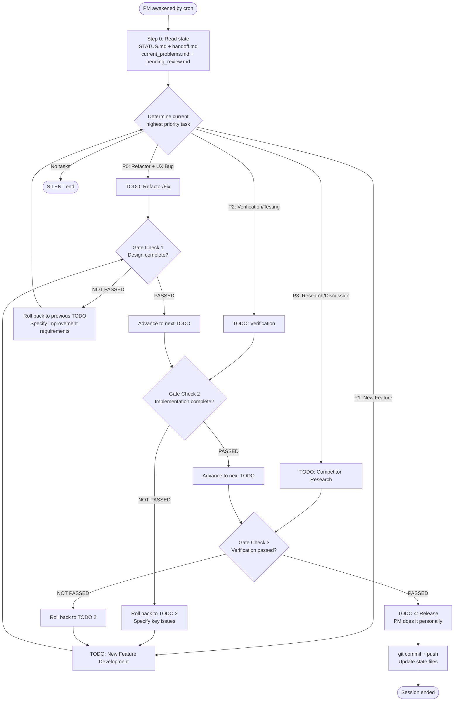
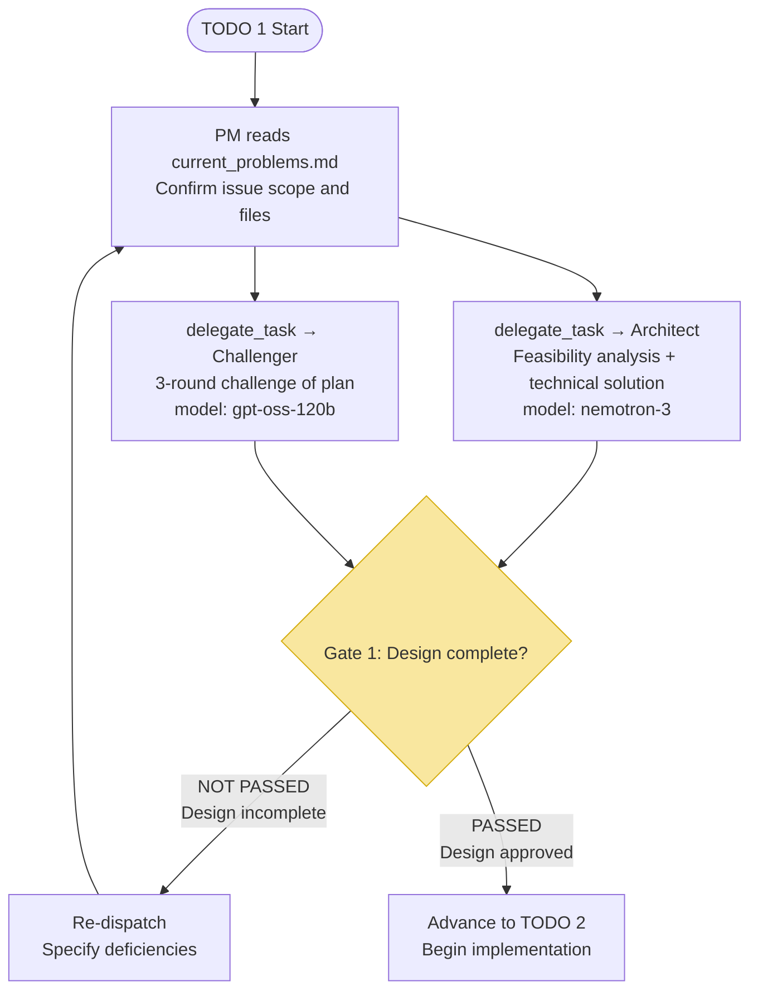
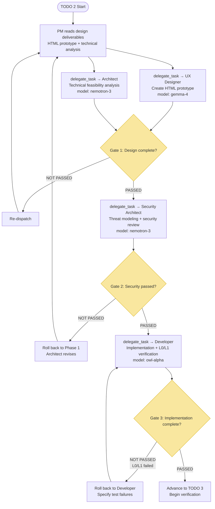
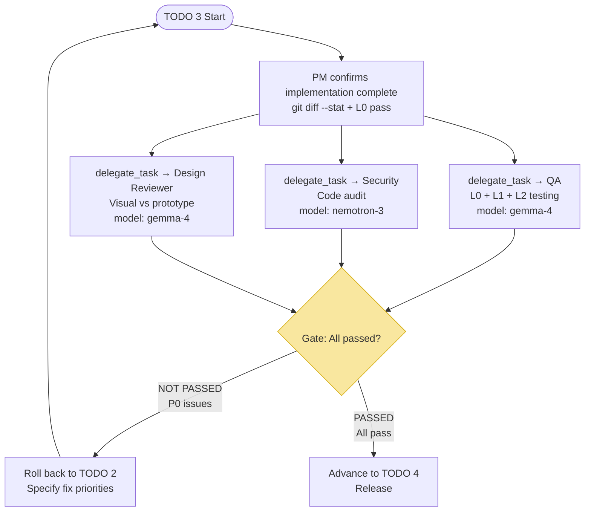
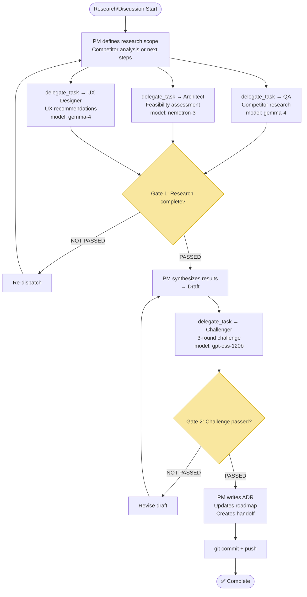
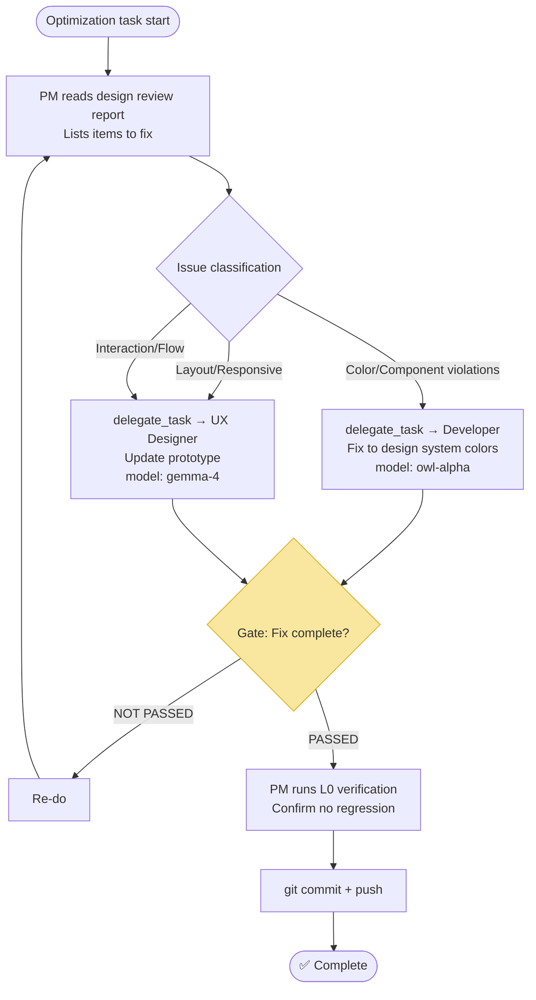

# Stock Explorer — PM Flow Diagrams

> This file contains Mermaid visualizations of all PM workflows.
> AGENTS.md references this file as a visual reference.

---

## Diagram 1: PM Decision Flow After Cron Session Wake-up



---

## Diagram 2: TODO 1 — Refactor/Bug Fix



**Participants:** Architect (`nemotron-3`) + Challenger (`gpt-oss-120b`)
**Completion criteria:** Technical analysis/ADR exists + Challenger passes 3 rounds

---

## Diagram 3: TODO 2 — New Feature Development (New Feature / UI)



**Participants:** UX Designer (`gemma-4`) + Architect (`nemotron-3`) + Security (`nemotron-3`) + Developer (`owl-alpha`)
**Completion criteria:** HTML prototype exists + Security pass + L0/L1 all pass + git commit

---

## Diagram 4: TODO 3 — Verification (Verify / Test)



**Participants:** QA (`gemma-4`) + Security (`nemotron-3`) + Design Reviewer (`gemma-4`)
**Completion criteria:** L0 + L1 + L2 all pass + no security critical issues + no P0 visual deviations

---

## Diagram 5: TODO 4 — Release (PM Does It Personally)

```mermaid
flowchart TD
    START([TODO 4 Start]) --> PM1[Update docs/state/handoff.md<br/>Session summary]
    PM1 --> PM2[Update docs/state/current_problems.md<br/>Mark resolved]
    PM2 --> PM3[Update docs/state/pending_review.md<br/>Clear reviewed items]
    PM3 --> PM4[Update docs/overview/05-roadmap.md<br/>Mark features complete]
    PM4 --> PM5[git add -A<br/>git commit -m "type: summary"<br/>git push]
    PM5 --> END([✅ Task complete])

    style PM5 fill:#d5f5e3,stroke:#27ae60
```

**Only PM does this personally, no sub-agents.**

---

## Diagram 6: Research/Discussion (Research / Discuss)



---

## Diagram 7: Optimization (Design Review Fixes)



---

## Role and Model Reference Table

| Role | Model | Primary TODO Participation |
|------|-------|---------------------------|
| **PM** | `openrouter/owl-alpha` | TODO 4 (personal) + all Gate Checks |
| **Architect** | `openrouter/nvidia/nemotron-3-super-120b-a12b:free` | TODO 1, 2, 6 |
| **Security Architect** | `openrouter/nvidia/nemotron-3-super-120b-a12b:free` | TODO 2, 3 |
| **UX Designer** | `openrouter/google/gemma-4-31b-it:free` | TODO 2, 6, 7 |
| **Developer** | `openrouter/owl-alpha` | TODO 1, 2, 7 |
| **Design Reviewer** | `openrouter/google/gemma-4-31b-it:free` | TODO 3 |
| **QA** | `openrouter/google/gemma-4-31b-it:free` | TODO 3, 6 |
| **Challenger** | `openrouter/openai/gpt-oss-120b:free` | TODO 1, 6 |
