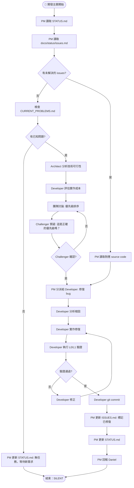

# 🔧 開發主題工作流（DEV WORKFLOW）

> 當 STATUS.md 指定主題為「開發」時，PM 按照此工作流執行。

---

## 開發主題工作目标
- 修復 `docs/status/issues.md` 中的 bug
- 實作新功能
- 通過 L0/L1 驗證

---

## 流程圖（完整）



---

## PM 的任務（詳細）

### Step 1：讀取狀態
```
讀取以下檔案：
1. STATUS.md → 確認本次主題為「開發」
2. docs/status/issues.md → 列出所有未解決的 issues
3. docs/status/current_problems.md → 了解已知問題
```

### Step 2：分派工作
```
根據 issue 類型分派：
- Bug fix → Developer
- 需要架構分析 → 先分派 Architect
- 需要設計審查 → 確認 Design Reviewer 參與
```

### Step 3：驗證與提交
```
1. 確認 Developer 執行 L0/L1 驗證通過
2. 確認 ISSUES.md 已更新
3. 確認 STATUS.md 已更新
4. git commit
```

---

## Sub-agent 的任務

### Developer 🔧
1. 讀取被指派的 issue
2. 讀取相關 source code
3. 分析根因（不要盲目 trial-and-error）
4. 實作修復
5. 執行 `uv run python _verify_layer0.py`
6. 執行 `uv run python _verify_layer1.py`
7. 驗證通過後 git commit（英文 message）
8. 清除 ISSUES.md 中對應的 issue

### QA Engineer 🧪
1. 執行 L0 驗證
2. 執行 L1 驗證
3. 報告所有失敗項目
4. 確認 bug 已修復

### Challenger 🔥
**在開發主題中，Challenger 只負責質疑「優先級」：**
- 這個 bug 真的需要現在修嗎？
- 修復的優先級正確嗎？
- 有沒有更重要的 issue 被忽略了？

---

## 狀態更新

PM 必須在 STATUS.md 更新：

```markdown
## 驗證紀錄
| 日期 | Gate 1 (Import) | Gate 2 (Render) | Gate 3 (Smoke) | 備註 |
|------|-----------------|-----------------|----------------|------|
| YYYY-MM-DD HH:MM | ✅ 52/52 (L0) | ✅ 18/18 (L1) | — | 修復 ISSUE-XXX |
```

---

*最後更新：2026-06-09*
