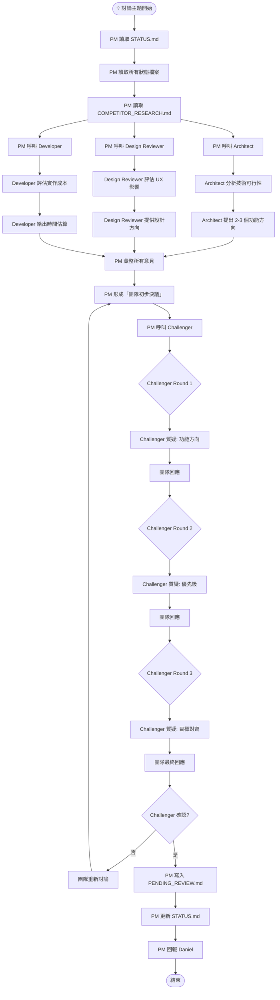

# 💡 討論主題工作流（DISCUSS WORKFLOW）

> 當 STATUS.md 指定主題為「討論」時，PM 按照此工作流執行。

---

## 討論主題工作目标
- 討論新功能方向
- 評估未來發展路線
- 收集各角色意見
- 形成團隊共識

---

## 流程圖（完整）



---

## 三輪反證流程（詳細）

### Round 1：功能方向質疑
```
Challenger 問：
- 這個功能方向真的符合產品願景嗎？
- 有沒有其他更好的方向？
- 競品怎麼做的？我們為什麼要這樣做？

團隊回應：
- Architect 補充技術分析
- Design 補充 UX 分析
- Developer 補充成本分析
```

### Round 2：優先級質疑
```
Challenger 問：
- 這個功能的優先級正確嗎？
- 有沒有更重要的事要先做？
- 這個時間點做這個功能合適嗎？

團隊回應：
- PM 根據 STATUS.md 優先級回應
- 各角色補充意見
```

### Round 3：目標對齊質疑
```
Challenger 問：
- 這個方案有助於達成專案目標嗎？
- 各角色的意見有沒有矛盾？
- 有沒有遺漏的風險？

團隊回應：
- 最終確認或修正方案
```

---

## PM 的任務（詳細）

### Step 1：讀取狀態
```
1. STATUS.md → 確認本次主題為「討論」
2. docs/status/issues.md → 了解目前 issues
3. docs/status/pending_review.md → 了解待決策事項
4. docs/research/competitor_research.md → 了解競品動態
5. docs/strategy/product_vision.md → 校對產品願景
```

### Step 2：呼叫 sub-agents（敏捷討論）
```
同時呼叫（parallel）：
- Architect：分析技術可行性、提出功能方向
- Design Reviewer：評估 UX 影響、提供設計方向
- Developer：評估實作成本
```

### Step 3：彙整決議
```
收集所有 sub-agent 意見後：
1. PM 形成「團隊初步決議」
2. 記錄各角色的不同意見
3. 準備進入反證階段
```

### Step 4：反證階段
```
1. 呼叫 Challenger，提供「團隊初步決議」
2. 進行至少 3 輪反證
3. 每輪記錄質疑內容和團隊回應
4. Challenger 確認後才能往下走
```

### Step 5：寫入文件
```
1. 新功能建議 → docs/status/issues.md（標記 source: team discussion）
2. 需要 Daniel 決策 → docs/status/pending_review.md
3. 更新 STATUS.md
```

---

## Sub-agent 的任務

### Architect 🏗️
1. 讀取 `docs/design/architecture.md`
2. 讀取 `docs/research/competitor_research.md`
3. 提出 2-3 個技術可行的功能方向
4. 分析每個方向的技术影響
5. 回應 Challenger 的質疑

### Design Reviewer 🎨
1. 讀取 `docs/design/design_system.md`
2. 評估新功能的 UX 影響
3. 提供設計方向建議
4. 參考競品設計模式
5. 回應 Challenger 的質疑

### Developer 💻
1. 評估每個功能方向的實作成本
2. 給出時間估算
3. 分析技術風險
4. 回應 Challenger 的質疑

### Challenger 🔥
1. **聆聽**所有 sub-agent 的意見
2. **質疑**功能方向的合理性
3. **質疑**優先級是否正確
4. **質疑**是否與產品目標對齊
5. 至少 3 輪反證後才確認

---

## 狀態更新

PM 必須在 STATUS.md 更新：

```markdown
## 💡 討論記錄 - YYYY-MM-DD
- **主題**：[討論主題]
- **Architect 建議**：[建議內容]
- **Designer 建議**：[建議內容]
- **Developer 評估**：[成本估算]
- **Challenger 反證**：[3 輪摘要]
- **最終決議**：[決議內容]
- **待 Daniel 決策**：[寫入 PENDING_REVIEW.md 的項目]
```

---

*最後更新：2026-06-09*
