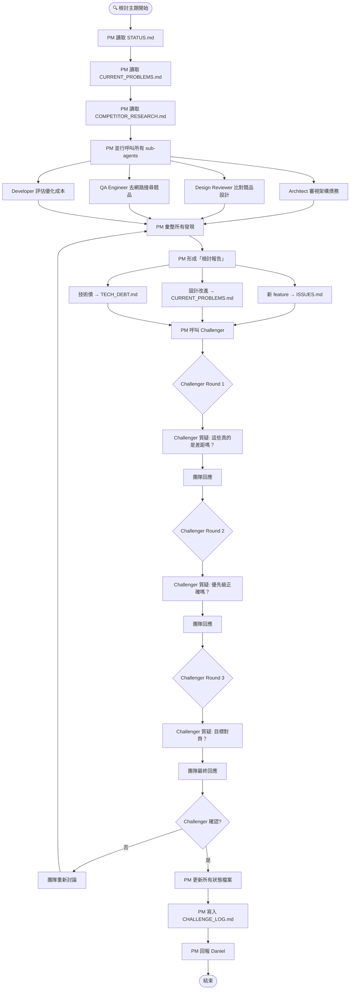

# 🔍 檢討主題工作流（REVIEW WORKFLOW）

> 當 STATUS.md 指定主題為「檢討」時，PM 按照此工作流執行。

---

## 檢討主題工作目标
- 審視產品缺失
- 優化現有功能
- **競品研究**：去網路搜尋類似產品，比對功能差距
- 產生新的 feature 建議

---

## 流程圖（完整）



---

## 三輪反證流程（詳細）

### Round 1：差距真實性質疑
```
Challenger 問：
- 這些「功能差距」真的是差距嗎？還是我們根本不需要？
- 競品做了，不代表我們也要做。為什麼我們要做？
- 有沒有「競品沒做但我們應該做的」？

團隊回應：
- QA 補充競品研究細節
- Designer 補充 UX 分析
- Architect 補充技術可行性
```

### Round 2：優先級質疑
```
Challenger 問：
- 這些新功能的優先級正確嗎？
- 應該先做什麼？為什麼？
- 有沒有更重要的技術債要先處理？

團隊回應：
- PM 根據 STATUS.md 優先級回應
- Developer 補充成本分析
```

### Round 3：目標對齊質疑
```
Challenger 問：
- 這個優化方向符合產品願景嗎？
- 有沒有矛盾的地方？
- 風險是什麼？

團隊回應：
- 最終確認或修正方案
```

---

## PM 的任務（詳細）

### Step 1：讀取狀態
```
1. STATUS.md → 確認本次主題為「檢討」
2. docs/status/current_problems.md → 了解已知問題
3. docs/research/competitor_research.md → 了解上次競品研究結果
4. docs/status/tech_debt.md → 了解技術債
```

### Step 2：並行呼叫 sub-agents
```
同時呼叫（parallel）：
- Architect：審視架構債務、提出重構建議
- Design Reviewer：比對競品設計、提出設計改進
- QA Engineer：去網路搜尋競品、比對功能差距
- Developer：評估優化成本
```

### Step 3：彙整檢討報告
```
收集所有 sub-agent 意見後：
1. 整理功能差距清單
2. 整理設計改進建議
3. 整理技術債優先級
4. 形成「檢討報告」
```

### Step 4：反證階段
```
1. 呼叫 Challenger，提供「檢討報告」
2. 進行至少 3 輪反證
3. 每輪記錄質疑內容和團隊回應
4. Challenger 確認後才能往下走
```

### Step 5：寫入文件
```
1. 新 feature → docs/status/issues.md（標記 source: competitor research）
2. 設計改進 → docs/status/current_problems.md
3. 技術債 → docs/status/tech_debt.md
4. 反證記錄 → docs/workflow/challenge_log.md
5. 更新 STATUS.md
```

---

## Sub-agent 的任務

### QA Engineer 🧪（競品研究主力）
1. **去網路搜尋**競品資訊（Yahoo Finance、TradingView、Finviz、財報狗、GoodInfo、CMoney 等）
2. 比對 Stock Explorer 功能差距
3. 寫入 `docs/research/competitor_research.md`
4. 新 feature 建議寫入 `docs/status/issues.md`

### Architect 🏗️
1. 讀取 `docs/status/tech_debt.md`
2. 審視架構債務
3. 提出重構建議
4. 分析效能瓶頸

### Design Reviewer 🎨
1. 比對競品設計
2. 提出設計改進方案
3. 審查 DESIGN_SYSTEM.md 是否需要更新

### Developer 💻
1. 評估每個優化的實作成本
2. 給出時間估算
3. 分析技術風險

### Challenger 🔥
1. **質疑**功能差距的真實性
2. **質疑**優先級是否正確
3. **質疑**是否與產品目標對齊
4. 至少 3 輪反證後才確認

---

## 競品研究清單

QA Engineer 必須在檢討主題時研究以下競品：

| 競品 | 網址 | 研究重點 |
|------|------|----------|
| Yahoo Finance | finance.yahoo.com | 總覽、導航、watchlist |
| TradingView | tradingview.com | 圖表、技術分析、社群 |
| Finviz | finviz.com | 篩選器、heatmap |
| 財報狗 | statementdog.com | 白話解釋、教育內容 |
| GoodInfo | goodinfo.tw | 除權息、基本面 |
| CMoney | cmoney.tw | App 生態、AI 選股 |
| 玩股網 | wantgoo.com | 股市溫度、PPT 匯出 |

---

## 狀態更新

PM 必須在 STATUS.md 更新：

```markdown
## 🔍 檢討記錄 - YYYY-MM-DD
- **競品研究**：QA Engineer 完成 [N] 個競品分析
- **功能差距**：[N] 項新功能建議
- **設計改進**：[N] 項改進建議
- **技術債**：[N] 項待處理
- **Challenger 反證**：[3 輪摘要]
- **待 Daniel 決策**：[寫入 PENDING_REVIEW.md 的項目]
```

---

*最後更新：2026-06-09*
